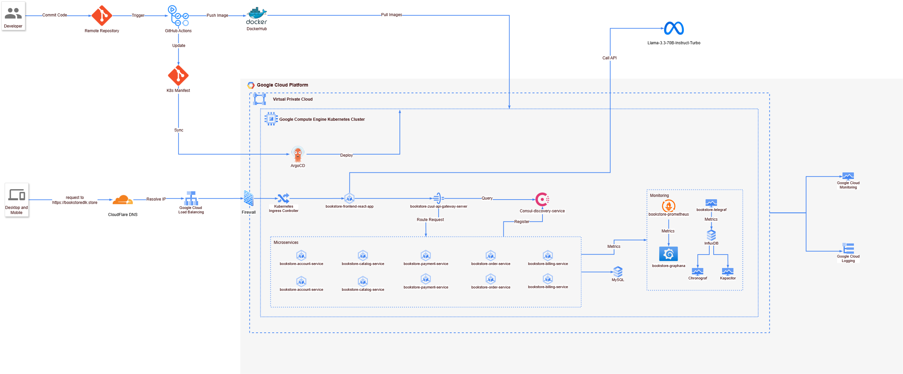

# BookStoreApp - Ứng Dụng Nhà Sách Phân Tán

[](http://hits.dwyl.io/devdcores/BookStoreApp-Distributed-Application)

---

## 📚 Giới thiệu dự án

Đây là một dự án Thương mại điện tử (Ecommerce) đang trong quá trình phát triển, cho phép người dùng thêm sách vào giỏ hàng và mua sách.

Ứng dụng được phát triển sử dụng Java, Spring (Spring Boot, Spring Cloud) và React. Kiến trúc Microservices được áp dụng triệt để để xây dựng một hệ thống phân tán.

---

## 🤖 AI Chatbot hỗ trợ khách hàng

Dự án tích hợp **AI Chatbot** thông minh giúp khách hàng tìm kiếm và gợi ý sách phù hợp dựa trên kho sách hiện có. Chatbot sử dụng nền tảng TogetherAI (Llama 3) với các tính năng nổi bật:

- **Gợi ý sách theo sở thích, từ khóa, thể loại, đánh giá, v.v.**
- **Đa ngôn ngữ:** Chatbot có thể trả lời bằng tiếng Việt, tiếng Anh hoặc ngôn ngữ mà người dùng sử dụng.
- **Chỉ gợi ý sách có trong kho:** Đảm bảo các đề xuất đều dựa trên dữ liệu thực tế của cửa hàng.
- **Tích hợp đánh giá, nhận xét khách hàng:** Chatbot sử dụng thông tin đánh giá và nhận xét để tư vấn chi tiết hơn.
- **Phản hồi nhanh, thân thiện, chuyên nghiệp.**
- **Không "bịa" sách không có trong kho.**

> **Lưu ý:** API AI Chatbot sử dụng TogetherAI, có thể cần cấu hình biến môi trường `REACT_APP_TOGETHER_API_KEY` trong frontend.

---

## 🏛️ Kiến trúc hệ thống

<!-- 
*(Lưu ý: Sơ đồ này minh họa kiến trúc triển khai dự kiến trên AWS. Kiến trúc hiện tại đang chạy trên Kubernetes)* -->


*   **Microservices:** Các dịch vụ lõi (Account, Billing, Catalog, Order, Payment) được xây dựng bằng Spring Boot.
*   **API Gateway:** `bookstore-zuul-api-gateway-server` (Zuul) đóng vai trò là cổng vào duy nhất cho các yêu cầu từ client. Nó định tuyến yêu cầu đến các microservice phù hợp.
*   **Service Discovery:**
    *   Khi chạy với Docker Compose hoặc Kubernetes: `bookstore-consul-discovery` (Consul) được sử dụng để các dịch vụ tự động tìm thấy nhau.
    *   Khi chạy từng service độc lập trên máy local (qua IDE): Eureka được sử dụng (ít khuyến khích hơn).
*   **Cơ sở dữ liệu:** `bookstore-mysql-db` (MySQL) lưu trữ dữ liệu cho các dịch vụ.
*   **Giao diện người dùng (Frontend):** Được xây dựng bằng React (`bookstore-frontend-react-app`).
*   **Giám sát và Theo dõi (Monitoring & Tracing):**
    *   **Tracing:** `bookstore-zipkin` thu thập và hiển thị dữ liệu theo dõi phân tán.
    *   **Monitoring:** Sử dụng kết hợp Prometheus, Grafana và TICK Stack (Telegraf, InfluxDB, Chronograf, Kapacitor) để thu thập, lưu trữ và trực quan hóa metrics hệ thống.

**Luồng giao tiếp chính (Kubernetes):**

1.  Client (trình duyệt/ứng dụng) gửi yêu cầu đến API Gateway (Zuul) thông qua NodePort của service `bookstore-zuul-api-gateway-server`.
2.  API Gateway truy vấn Consul Discovery để tìm địa chỉ của microservice cần thiết.
3.  API Gateway định tuyến yêu cầu đến microservice tương ứng (Account, Catalog, Order, v.v.).
4.  Các microservices tương tác với nhau (nếu cần) với cơ sở dữ liệu MySQL.
5.  Tất cả các microservices gửi dữ liệu tracing đến Zipkin.
6.  Telegraf thu thập metrics từ các services/pods và gửi đến InfluxDB.
7.  Prometheus thu thập metrics từ các endpoint được cấu hình (có thể thông qua Consul).
8.  Grafana và Chronograf trực quan hóa dữ liệu từ Prometheus và InfluxDB.
9.  Kapacitor xử lý dữ liệu từ InfluxDB để tạo cảnh báo.

---

## ⚙️ Điều kiện tiên quyết

*   [Java](https://www.java.com/) (Phiên bản 11 hoặc cao hơn)
*   [Maven](https://maven.apache.org/)
*   [Node.js](https://nodejs.org/) và [Yarn](https://yarnpkg.com/) (cho Frontend)
*   [Docker](https://www.docker.com/) và [Docker Compose](https://docs.docker.com/compose/) (Để chạy với Docker)
*   [kubectl](https://kubernetes.io/docs/tasks/tools/install-kubectl/) (Để tương tác với Kubernetes)
*   [Git](https://git-scm.com/)

---

## 🚀 Cài đặt và Chạy dự án

Có hai cách chính để chạy dự án: sử dụng Docker Compose (khuyến nghị) hoặc chạy trên Kubernetes.

### 🐳 Chạy với Docker Compose (Khuyến nghị cho môi trường local)

Cách này sẽ khởi chạy tất cả các microservices, cơ sở dữ liệu, Consul, và hệ thống giám sát trong các Docker container.

1.  **Build các microservices:**
    Mở terminal tại thư mục gốc của dự án và chạy lệnh sau để build tất cả các file JAR:
    ```bash
    mvn clean install
    ```

2.  **Khởi chạy các containers:**
    ```bash
    docker-compose up --build
    ```
    Lệnh này sẽ build các image (nếu chưa có) và khởi động tất cả các service được định nghĩa trong `docker-compose.yml`.

3.  **Truy cập các dịch vụ:**
    Các dịch vụ sẽ được expose qua các cổng sau trên máy local của bạn:

    *   **API Gateway (Zuul):** `http://localhost:8765`
    *   **Consul UI:** `http://localhost:8500`
    *   **Zipkin:** `http://localhost:9411`
    *   **Grafana:** `http://localhost:3030` (Tài khoản mặc định: admin/admin)
    *   **Prometheus:** `http://localhost:9090`
    *   **Chronograf:** `http://localhost:8888`
    *   (Các cổng dịch vụ khác như Account, Catalog,... thường không truy cập trực tiếp mà qua API Gateway)

### ☸️ Chạy trên Kubernetes

Phần này mô tả cách triển khai và quản lý ứng dụng trên cụm Kubernetes. Các tệp cấu hình YAML cho Kubernetes nằm trong thư mục `k8s` (giả định, cần kiểm tra lại).

1.  **Build và Push Docker Images:**
    Bạn cần build Docker image cho từng microservice và push chúng lên một Docker registry (ví dụ: Docker Hub, Google Container Registry). Script `build_and_push.sh` có thể hỗ trợ việc này.
    ```bash
    # Cấp quyền thực thi (chỉ lần đầu)
    chmod +x build_and_push.sh

    # Build và push images (thay 'your-docker-repo' bằng tên repo của bạn)
    ./build_and_push.sh your-docker-repo
    ```
    *Lưu ý: Cần chỉnh sửa script `build_and_push.sh` để trỏ đến đúng Docker repository của bạn.*

2.  **Triển khai lên Kubernetes:**
    Áp dụng các tệp cấu hình Kubernetes. Giả sử tất cả các tệp YAML nằm trong thư mục `k8s` và bạn muốn triển khai vào namespace `bookstore`:
    ```bash
    # Tạo namespace nếu chưa có
    kubectl create namespace bookstore

    # Áp dụng tất cả cấu hình trong thư mục k8s
    kubectl apply -f k8s/ -n bookstore
    ```
    *Lưu ý: Đường dẫn `k8s/` là giả định. Hãy thay bằng đường dẫn thực tế chứa các tệp YAML của bạn.*

3.  **Kiểm tra trạng thái Pods:**
    ```bash
    kubectl get pods -n bookstore
    ```
    Đảm bảo tất cả các pods đang ở trạng thái `Running`.

4.  **Truy cập ứng dụng qua NodePort:**
    Các dịch vụ được expose ra bên ngoài cụm Kubernetes thông qua NodePort. Bạn cần địa chỉ IP của một trong các worker node trong cụm Kubernetes và các NodePort tương ứng:

    | Dịch vụ                          | Cổng nội bộ (Port) | Cổng Node (NodePort) |
    | ------------------------------- | ------------------- | -------------------- |
    | MySQL DB                        | 3306                | 30001                |
    | Consul Discovery                | 8500                | 30002                |
    | **Zuul API Gateway**            | **8765**            | **30003**            |
    | Account Service                 | 4001                | 30004                |
    | Billing Service                 | 5001                | 30005                |
    | Catalog Service                 | 6001                | 30006                |
    | Order Service                   | 7001                | 30007                |
    | Payment Service                 | 8001                | 30008                |
    | Zipkin                          | 9411                | 30009                |
    | Prometheus                      | 9090                | 30010                |
    | Grafana                         | 3000                | 30011                |
    | InfluxDB                        | 8086                | 30012                |
    | Telegraf                        | 8125 (UDP)          | 30013                |
    | Chronograf                      | 8888                | 30014                |
    | Kapacitor                       | 9092                | 30015                |

    Truy cập API Gateway: `http://<WORKER_NODE_IP>:30003`
    Truy cập Grafana: `http://<WORKER_NODE_IP>:30011`
    Truy cập Zipkin: `http://<WORKER_NODE_IP>:30009`
    ... và các dịch vụ giám sát khác.

5.  **Một số lệnh `kubectl` hữu ích khác:**
    ```bash
    # Xem logs của một pod cụ thể (thay <pod-name>)
    kubectl logs <pod-name> -n bookstore

    # Truy cập vào shell của một pod (thay <pod-name>)
    kubectl exec -it <pod-name> -n bookstore -- /bin/sh

    # Xem thông tin chi tiết của một service (ví dụ: zuul)
    kubectl describe svc bookstore-zuul-api-gateway-server -n bookstore

    # Khởi động lại một deployment (ví dụ: zuul)
    kubectl rollout restart deployment/bookstore-zuul-api-gateway-server -n bookstore

    # Scale một deployment (ví dụ: scale account-service lên 3 replicas)
    kubectl scale deployment/bookstore-account-service --replicas=3 -n bookstore

    # Xóa tất cả tài nguyên trong namespace bookstore (CẨN THẬN!)
    # kubectl delete all --all -n bookstore
    ```

### 💻 Chạy Frontend (React App)

1.  **Điều hướng đến thư mục frontend:**
    ```bash
    cd bookstore-frontend-react-app
    ```
2.  **Cài đặt dependencies:**
    ```bash
    yarn install
    ```
3.  **Khởi chạy ứng dụng:**
    ```bash
    yarn start
    ```
    Ứng dụng React sẽ chạy trên `http://localhost:3000` (hoặc một cổng khác nếu 3000 đã bị chiếm dụng). Nó sẽ giao tiếp với API Gateway (chạy trên Docker hoặc Kubernetes).

---

## 📊 Giám sát và Theo dõi

Hệ thống tích hợp sẵn các công cụ mạnh mẽ để giám sát và theo dõi:

*   **Zipkin:** Theo dõi luồng xử lý yêu cầu qua các microservices.
    *   UI: `http://<địa_chỉ>:9411` (Docker) hoặc `http://<WORKER_NODE_IP>:30009` (Kubernetes)
*   **Prometheus:** Thu thập và lưu trữ metrics.
    *   UI: `http://<địa_chỉ>:9090` (Docker) hoặc `http://<WORKER_NODE_IP>:30010` (Kubernetes)
*   **Grafana:** Trực quan hóa metrics từ Prometheus/InfluxDB.
    *   UI: `http://<địa_chỉ>:3030` (Docker) hoặc `http://<WORKER_NODE_IP>:30011` (Kubernetes)
    *   Đăng nhập lần đầu: `admin` / `admin`
*   **TICK Stack (InfluxDB, Telegraf, Chronograf, Kapacitor):** Một bộ công cụ khác để thu thập, lưu trữ, trực quan hóa và cảnh báo metrics.
    *   **Chronograf UI:** `http://<địa_chỉ>:8888` (Docker) hoặc `http://<WORKER_NODE_IP>:30014` (Kubernetes)

**(Các ảnh chụp màn hình Zipkin, Grafana, Chronograf như trong README gốc có thể được giữ lại ở đây)**

---

## 🔧 Khắc phục sự cố

*   **Vấn đề kết nối giữa các service:**
    *   Kiểm tra logs của API Gateway (Zuul) và service discovery (Consul).
    *   Đảm bảo các service đã đăng ký thành công với Consul.
    *   Kiểm tra cấu hình định tuyến (routes) trong Zuul.
    *   Kiểm tra Network Policies trong Kubernetes (nếu có).
    *   Sử dụng `kubectl logs` và `kubectl describe` để kiểm tra trạng thái và sự kiện của các pod/service.
*   **Vấn đề cơ sở dữ liệu:**
    *   Nếu gặp lỗi liên quan đến schema database khi khởi động, có thể do thay đổi cấu trúc bảng chưa được áp dụng đồng bộ.
    *   Trong môi trường phát triển, giải pháp nhanh là xóa và tạo lại database `bookstore_db`. **CẨN THẬN: Chỉ thực hiện trên môi trường phát triển, sẽ mất hết dữ liệu.**
*   **Không truy cập được ứng dụng:**
    *   Kiểm tra xem các Pod có đang chạy không (`kubectl get pods -n bookstore`).
    *   Kiểm tra xem các Service có đang chạy và có Endpoints không (`kubectl get svc -n bookstore`, `kubectl get endpoints -n bookstore`).
    *   Kiểm tra xem NodePort có bị chặn bởi firewall không.
    *   Kiểm tra logs của Ingress controller (nếu sử dụng) và API Gateway.

Nếu gặp sự cố không giải quyết được, vui lòng tạo [Issue trên Github](https://github.com/devdcores/BookStoreApp-Distributed-Application/issues).

---

## 🔑 Thông tin xác thực (Ví dụ cho Account Service)

Để lấy `access_token` cho người dùng, bạn cần `clientId` và `clientSecret` (đây là thông tin cấu hình trong `account-service`).

*   **clientId:** `93ed453e-b7ac-4192-a6d4-c45fae0d99ac` (Ví dụ)
*   **clientSecret:** `client.devd123` (Ví dụ)

**Người dùng mẫu:**

*   **Admin:**
    *   userName: `admin.admin`
    *   password: `admin.devd123`
*   **Normal User:**
    *   userName: `devd.cores`
    *   password: `cores.devd123`

**Lấy Access Token (Ví dụ cho Admin User khi chạy local/docker):**

```bash
curl -u 93ed453e-b7ac-4192-a6d4-c45fae0d99ac:client.devd123 http://localhost:4001/oauth/token -d grant_type=password -d username=admin.admin -d password=admin.devd123
```

*Lưu ý: Khi chạy trên Kubernetes, bạn cần thay `localhost:4001` bằng endpoint phù hợp (ví dụ: qua API Gateway `http://<WORKER_NODE_IP>:30003/account/oauth/token` - cần kiểm tra lại cấu hình route của Zuul).*

# Test CI